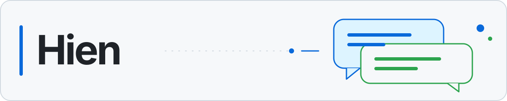

<picture>
  <source media="(prefers-color-scheme: dark)" srcset="assets/profile-banner-dark.svg">
  
</picture>

# Hi, I'm Hien

**AI · Deep learning · Developer tools**

I explore AI through projects, experiments, and tools that make development workflows easier to use.

[Projects](#selected-projects) · [About](#about) · [Contact](#contact) · [All repositories](https://github.com/hiendang7613?tab=repositories)

## Selected projects

### [ihav Agent Room](https://github.com/hiendang7613/ihav-agent-room)

Native Claude Code and Codex sessions with shared, durable room coordination.

### [ihav ASD-STE100](https://github.com/hiendang7613/ihav-asd-ste100)

A plugin for short, predictable AI replies across languages, with structured status updates.

## About

I'm interested in deep learning, computer vision, natural language processing, and practical AI tools.

**Languages and tools:** Python · C++ · PyTorch · TensorFlow · MySQL · Git

## Contact

[Email](mailto:dvhqnn1@gmail.com) · [Facebook](https://www.facebook.com/hiendang7613/)
